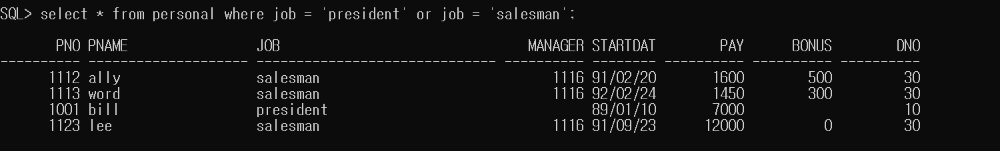

# SQL 과제 1

1. 업무가 clerk가 아니고 manager이 아닌 사원.
   <pre><code>select * from personal where not(job='clerk') and not(job='manager');</code></pre>
     
   #
2. 입사일이 1991이후 사원중 급여가 2000 이하인 사원.
   <pre><code>select * from personal where startdate >= '91/01/01' and pay <= 2000;</code></pre>
     
   #
3. 업무가 president 거나 salesman인 사원.
   <pre><code>select * from personal where job = 'president' or job = 'salesman';</code></pre>
     
   #
4. 사원이름 첫 글자가 a부터 k까지 인 사원을 이름순으로 정렬.
    <pre><code>select pname from personal where pname between 'a%' and 'k%' order by pname;</code></pre>
      
    #
